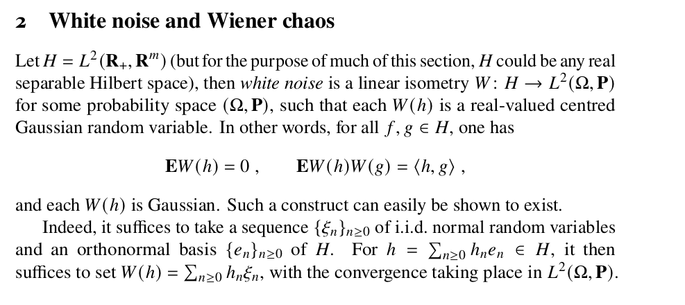

# Overview 

Let's deep dive into this piece of nice math 

Posted on 

https://www.linkedin.com/feed/update/urn:li:activity:7233042653532061696/

Random Fri evening reading 

The one in the first comment is an interesting piece of Stochastic Calculus but, as it usually happens in math, there are some parts that are not so obvious / clear, so let’s deep dive into them 

In this piece there are probably 2 

1) why $E[W(g)W(h)] = \langle h,g \rangle$

2) the relationship between the $\{e_{n}\}$ Hilbert Base and the $\{\xi_{n}\}$ Probability Space base 

Here we are going to focus on 1 only, to limit the length of the piece

So first of all let’s observe $W$ is assumed to be a linear isometry between an Hilbert Space, which is an L2 space, and an L2 probability space 

An isometry preserves the “distances” and the “angles“ that result from the inner product which for an L2 space coincides with the norm (while this is not true for the other Lp spaces) 

The equation regarding the expected value is related to this isometry property so essentially to the the fact the inner product is preserved 

The right term is in fact $\langle h,g \rangle_{H} = \int_{X}h(x)g(x) d \mu(x)$ the inner product in the domain of $W$ so by the isometry property we need that $\langle h,g \rangle_{H} = \langle W(h), W(g) \rangle_{L^{2}(\Omega, \mathbb{P})}$  meaning that for any pair of elements in the domain space, the inner product in the domain and image space should be the same  

The definition of the right term in the above, in the special case of real value functions is $\langle W(h), W(g) \rangle = \int_{X} W(h(x)) W(g(x)) d \mu(x)$ otherwise in the more general case of complex value functions the complex conjugate would have been required

The definition of the expected value in the probability space is then $E[W(h)W(g)] = \int_{\Omega}W_{h}(\omega) W_{g}(\omega) P(d\omega)$ with $W_{h} = W(h)$ random variable, at this point we just need to observe that $W_{h}(\omega) \quad \forall \omega \in \Omega$ is equivalent to $W(h(x)) \quad \forall x \in X$ as they are just 2 different ways of writing and expression the same concept: in the first perspective it is a random variable and in the second a composition of functions 

---

Posted on 

https://www.linkedin.com/feed/update/urn:li:activity:7233105087936552960/

Regarding this previous post of mine  https://www.linkedin.com/feed/update/urn:li:activity:7233042653532061696/Let’s now focus on 2 here

Since $\{e_{n}\}$ is an orthonormal basis for $H$ then $h = \sum_{n \ge 0} h_{n} e_{n}$ meaning every element of $H$ can be expressed by $\{h_{n}\}$ a unique set of coefficients (the uniqueness of the coefficients can be proved using the uniqueness of the Cauchy Sequences convergence and the completeness of the space)

Now we can apply $W(h)$ and for the linearity we have $W(h) = \sum_{n \ge 0} h_{n} W(e_{n}) \quad \forall h \in H$ and notice that $h_{n} \in \mathbb{R} \quad \forall n \ge 0$ this is why it was possible to get it out 

This means we have $\xi_{n} = W(e_{n})$ meaning each element of the orthonormal basis is mapped into a random variable in the probability space 

Now we want to prove that $\{\xi_{n}\}$ are IID random variables and to so we need to prove 2 things: they need to be Gaussian and uncorrelated 

The Gaussianity of $\xi_{n}$ is a direct consequence of being samples of White Noise 

To prove they are uncorrelated we just use the isometry property 

For the isometry property we have $\langle e_{i}, e_{j} \rangle = E[W(e_{i}), W(e_{j})]$ and since in the Hilbert Space this is an orthonormal basis then $\langle e_{i}, e_{j} \rangle = 0 \quad \forall i \neq j$ then $E[W(e_{i}), W(e_{j})] = 0 \quad \forall i \neq j$ and therefore they are uncorrelated  

